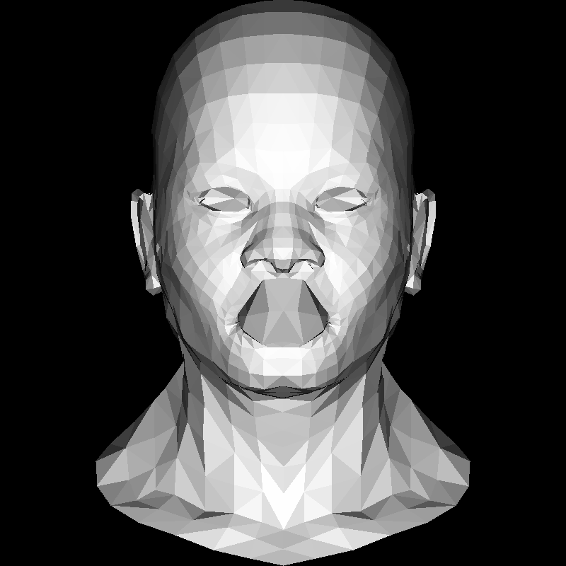
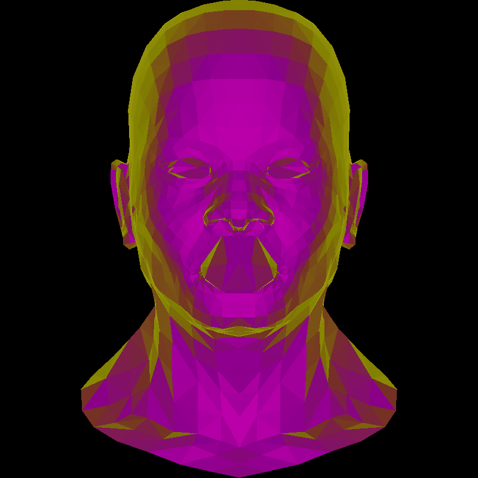
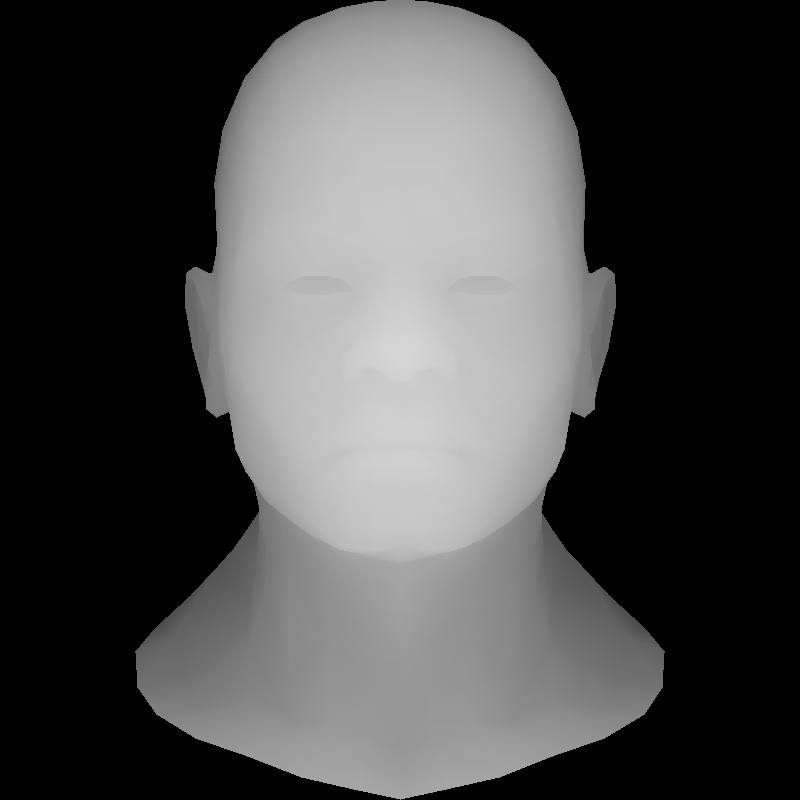
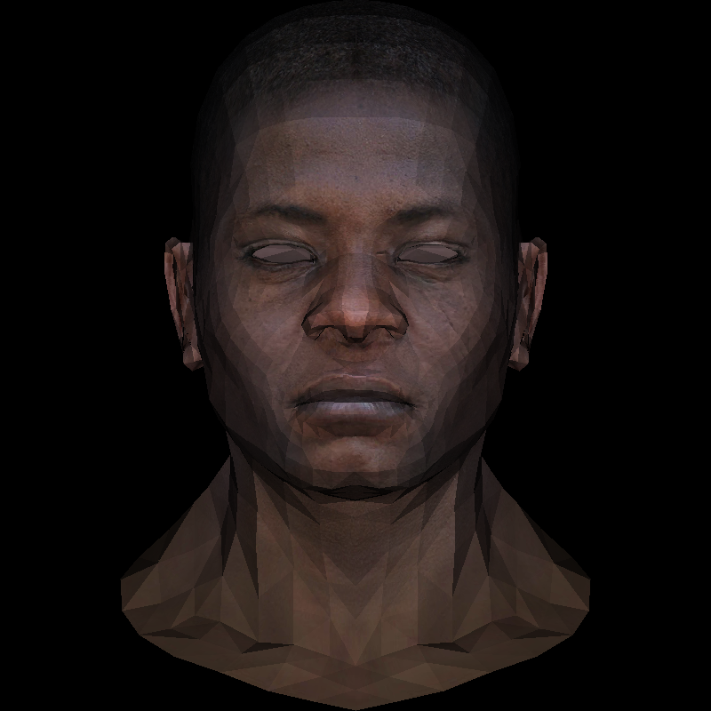
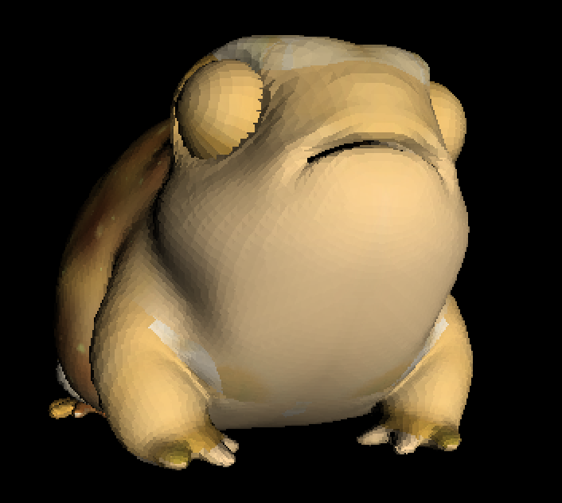
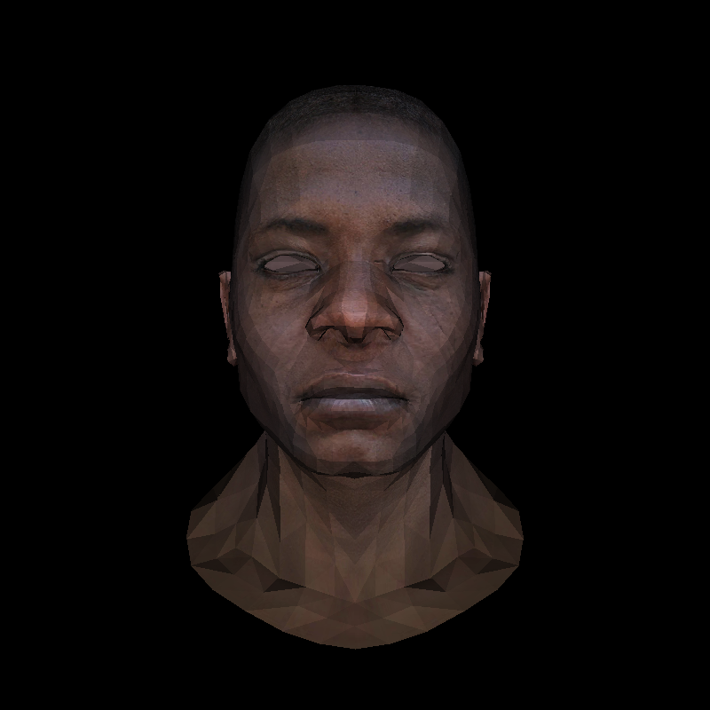
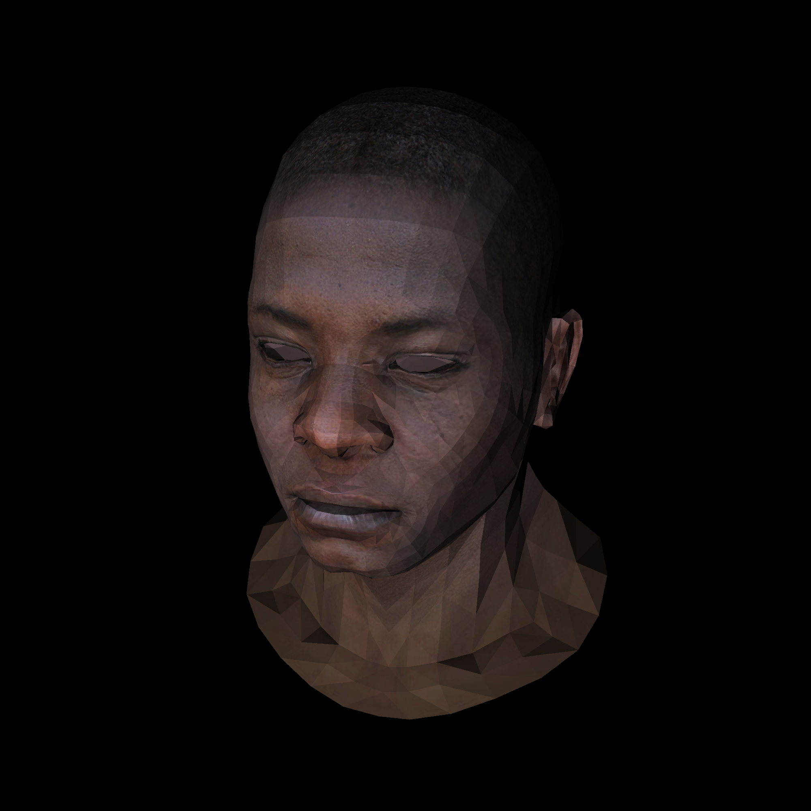

# tinyrenderer-rust

Implementing the Dmitry V. Sokolov (ssloy) tinyrenderer in rust.

The goal at first is port the main logic to rust with minimal changes besides maybe rust special stuff. Also I try to always generate the same images as the original cpp code,

### Progress

### Results

Just some images that were generated while coding this.

#### Gray shaded head

The normal generated image

#### Color theme shading

I added a function that allows shading by a range of colors

#### Z Buffer integrated into the scanline method

#### Texture mapping

Frog test:

#### Perspective correction

#### Moving the camera

