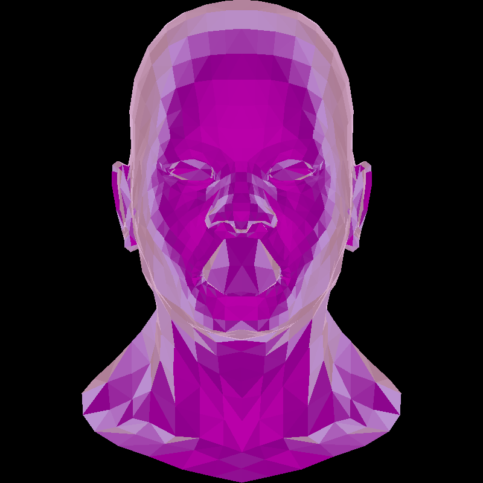

# tinyrenderer-rust

Implementing the Dmitry V. Sokolov (ssloy) tinyrenderer in rust.

The goal at first is port the main logic to rust with minimal changes besides maybe rust specialities.

### Progress

### Results

Just some images that were generated while coding.

#### Lesson 2 - Triangle rasterization and back face culling

##### Gray shaded head

The normal generated image

##### Magenta shaded head

Just a test with magenta shades

##### Color theme shading

I added a function that allows shading by a range of colors

